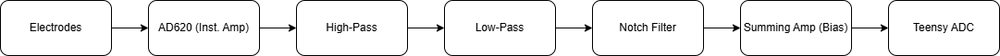

# Low-cost EEG for Alpha and Beta Wave Monitoring

## Overview
This project demonstrates a low-cost EEG system for monitoring **alpha (8-13 Hz)** and **beta (13-30 Hz)** brain waves. It is designed for educational purposes, providing a hands-on way to learn about **analog and digital filter design** and to study brain activity without the need for expensive medical equipment.

The project plans to implement a chain of amplification and analog filtering stages to the Teensy 4.0 microcontroller for real-time analysis. The specific analysis code will plot both the output voltage and the corresponding Fast Fourier Transform (FFT) results to observe chnages in frequency information content.

## Component Choices

## Hardware Architecture (Ongoing)
My design is based off the signal flow block diagram, shown below:

### Stage 1: Instrumentation Amplifier (AD620)
Assuming microvolt level signals (~0.5 to 200 microvolts) the AD620 was configured for a gain of 89.2 to not overamplify the unwanted noise but to bring the signals within appropriate range for analog filtering.

Using the equation Gain = 1 + 49400/Rg = 1 + 49400/560ohm = 89.2.

### Stage 2: Bandpass Filtering (Butterworth/Sallen-Key):
Implemented bandpass filtering using first a highpass then a low pass second order butterworth filter. The cutoff frequnecy for the low pass was designed to be ~7.23Hz (fc = 1/(2pi*100k*220nF)). The lowpass was initially designed for cutoff of ~32.9Hz (fc = 1/(2pi*100k*220nF)).

However, after applying the notch filter in simulation the rolloff significantly increased for the lowpass so the cutoff was shifted significantly higher to get closer to the -3dB point. With theoretical of ~72.3Hz (fc = 1/(2pi*22k*100nF)).

This ensured that the desired frequency content would remain for analysis.

### Stage 3: Twin-T Notch Filter (60 Hz Rejection)
Since the human body acts like an antenna to decrease power line interference a notch filter was added. The filter follows a bootstrap design to increase the Q factor and have a sharper notch. The design was based off an adjustable [High Q Notch Filter](https://www.ti.com/lit/an/snoa680/snoa680.pdf?ts=1768248220553&ref_url=https%253A%252F%252Fwww.google.com%252F) design. 

In practice however this circuit was giving me problems leading to a shifted notch and reduced Q so I've temporily grounded the bootstrap and will see if its needed when testing later.

### Stage 4: Instrumentation Amplifier (AD620)
After analog filtering the signal is amplied for a second time for analyis on the computer. Currently the second amplification circuit will be the same as in stage 1 with a potnetitiomter to adjust the gain in order to set the signal at the appropraite scale for analysis.

### Stage 5: Summing Amp. (Bias)
The output wave is shifted to ensure the correct voltage range is input into the teensy (0V-3.3V)using the voltage divided 3.3V output from the teensy and decoupling capacitor???. The DC offset is ~1.3V close to center for whats accepted by the input pins on the teensy (Vout = [1+Ra/Rb](v1+V2/2). The diodes ensure protection of the teensy input pin from overvoltage events.

## Software and Digital Signal Processing (Ongoing)
The filtered EEG signal is read by one of the adc pins on the teensy. The baud rate is set for 115200 baud to ensure fast enough serial communication. The sample rate is also set for 500hz with a nyquist frequency of 250hz well above the 30Hz beta wave target to avoid aliasing and getting clean output. 

The software is written in python and uses the numpy library to apply the FFT to the input signal. Both the input voltage waveform and frequency spectrum is plotted. The buffer size is set to 1000 for close to real time analysis. The signals dc offset is also removed for the fourier analysis my subtracting the mean voltage (essentially applying a high pass filter at 0hz) to ensure the dc offset doesnt overpower the frequency content.

The code can be viewed here.

## Testing

